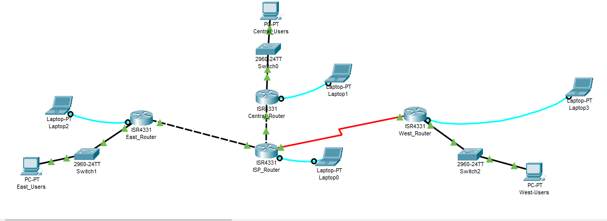
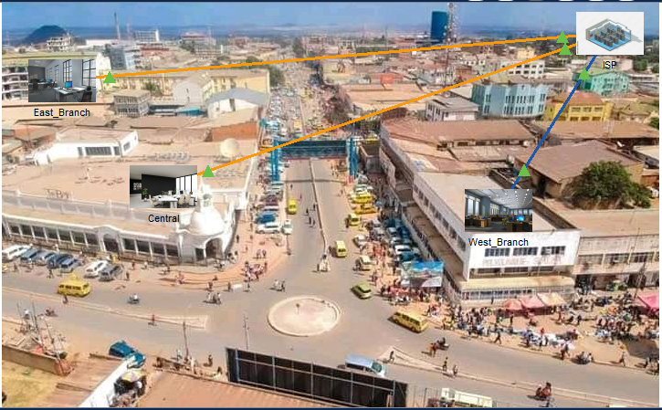

# Business Network Design with 3 Branches

---

## English Version 🇺🇸

### Project Overview
This Packet Tracer project demonstrates a multi-branch corporate network (Central, East, and West) interconnected via an ISP router using a full **IPv6** architecture.

### Routing Strategy
**Static routing** was intentionally chosen for this design to demonstrate a thorough understanding of network hop logic and manual path manipulation. This approach ensures full control over traffic flow between the different subnets.

### 1. Addressing Scheme & Link-Local Configuration
The network uses the global prefix `2001:DB8:ABCD::/64`. All router interfaces are also configured with **Link-Local** addresses to serve as gateways.

| Appliance | Interface | Global IPv6 Address | Link-Local Address | Default Gateway |
| :--- | :--- | :--- | :--- | :--- |
| **ISP Router** | G0/0/0 | 2001:DB8:ABCD:1::1/64 | FE80::1 | N/A |
| **ISP Router** | G0/0/1 | 2001:DB8:ABCD:3::1/64 | FE80::1 | N/A |
| **ISP Router** | S0/2/0 | 2001:DB8:ABCD:5::1/64 | FE80::1 | N/A |
| **CENTRAL Router** | G0/0 | 2001:DB8:ABCD:1::2/64 | FE80::2 | N/A |
| **CENTRAL Router** | G0/1 | 2001:DB8:ABCD:2::1/64 | FE80::1 | N/A |
| **Users_Central** | NIC | 2001:DB8:ABCD:2::3/64 | FE80::2 | FE80::1 |
| **EAST Router** | G0/0 | 2001:DB8:ABCD:3::2/64 | FE80::2 | N/A |
| **EAST Router** | G0/1 | 2001:DB8:ABCD:4::1/64 | FE80::1 | N/A |
| **Users_East** | NIC | 2001:DB8:ABCD:4::3/64 | FE80::2 | FE80::1 |
| **WEST Router** | s0/1/0 | 2001:DB8:ABCD:5::2/64 | FE80::2 | N/A |
| **WEST Router** | G0/1 | 2001:DB8:ABCD:6::1/64 | FE80::1 | N/A |
| **Users_West** | NIC | 2001:DB8:ABCD:6::3/64 | FE80::2 | FE80::1 |

### 2. Security Configurations
* **SSH v2:** Secure remote access configured on all branch routers.
* **Brute-Force Protection:** Login block for 3 minutes after 5 failed attempts.
* **Global Security:** Password encryption and minimum password length of 5 characters.

---

## Version Française 🇫🇷

### Présentation du Projet
Ce projet Packet Tracer simule un réseau d'entreprise interconnectant trois succursales (Central, East, West) via un routeur ISP, utilisant une architecture exclusivement **IPv6**.

### Choix du Routage
Le **routage statique** a été privilégié par souci de **compréhension pédagogique**. Cela permet de maîtriser la sélection des sauts (next-hop) et de visualiser le cheminement précis des données à travers l'infrastructure.

### 1. Plan d'Adressage et Link-Local
L'adressage global est basé sur le préfixe `2001:DB8:ABCD::/64`. Les interfaces des routeurs utilisent des adresses **Link-Local** pour la gestion des passerelles.

### 2. Sécurité & Services
* **Administration Sécurisée :** SSH activé avec domaine `Business.com`.
* **Protection :** Blocage automatique des accès après 5 tentatives infructueuses.
* **Confidentialité :** Chiffrement systématique des mots de passe.

---

## Topologies
### Logical View

### Physical View

## 🧪 How to Test / Comment Tester

### 🇺🇸 English Version
1. **IPv6 Connectivity**: Open the Command Prompt on any PC and use the command "ping <target_ipv6_address>" to test inter-branch connectivity using the addressing scheme table in the documentation file https://github.com/NICK01-maker/IPV6-Static_routing-ssh_Lab/blob/main/docs/Docs.docx. Use "tracert <target_ipv6_address>" to verify the path through the ISP and other branche.
2. **SSH Access**: From a PC terminal, use "ssh -l <username> <router_ipv6_address>" to ensure secure management is active. Usernames and passwords are also in the documentation file.
3. **Routing Table**: On any router, run "show ipv6 route" to confirm the static routes are correctly injected.
4. **Views**: Check the Logical view for green link status and the Physical view for the geographic layout of the three branches.

---

### 🇫🇷 Version Française
1. **Connectivité IPv6** : Ouvrez l'invite de commande sur n'importe quel PC et utilisez "ping <adresse_ipv6_cible>" pour tester la connexion entre les succursales. Utilisez "tracert <adresse_ipv6_cible>" pour vérifier le passage par l'ISP. Vous trouverez la table d'adressage dans le fichier de documentation https://github.com/NICK01-maker/IPV6-Static_routing-ssh_Lab/blob/main/docs/Docs.docx.
2. **Accès SSH** : Depuis le terminal d'un PC, utilisez "ssh -l <nom_utilisateur> <adresse_ipv6_du_routeur>" pour vérifier que la gestion sécurisée est active. les utilisateurs et leurs mots de passe sont aussi presents dans la documentation.
3. **Table de Routage** : Sur n'importe quel routeur, lancez "show ipv6 route" pour confirmer que les routes statiques sont bien configurées.
4. **Vues** : Vérifiez la vue Logique pour l'état des liens (verts) et la vue Physique pour l'implantation géographique des trois succursales.
